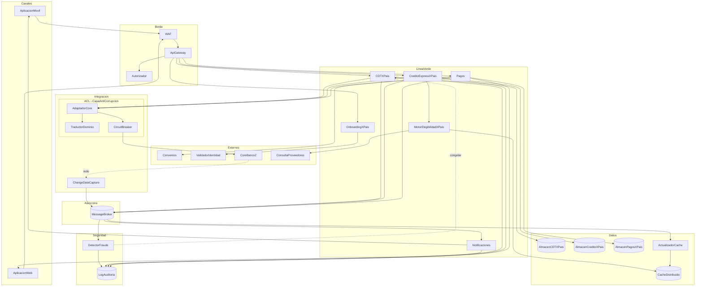

# Diagrama de Componentes — Línea Verde / Banco Z

Este documento explica cada componente de la **vista estructural general** revisada con el equipo, agrupado por subsistema, con su responsabilidad principal y el ASR que justifica su existencia.

## Diagrama

---

## Explicación por subsistema

### 1. Canales

Punto de entrada del cliente. Se ofrecen dos experiencias separadas pero contra el mismo backend.

| Componente | Responsabilidad | ASR |
|------------|----------------|-----|
| **AplicacionMovil** | App nativa para iOS / Android. Canal principal del cliente final. | Habilita el modelo "una sola app" del reto. |
| **AplicacionWeb** | Portal web equivalente. Mismas operaciones, distinto canal. | Cobertura adicional para clientes sin acceso a la app móvil. |

### 2. Borde

Frontera de seguridad y enrutamiento del sistema. Todo tráfico entra por aquí.

| Componente | Responsabilidad | ASR |
|------------|----------------|-----|
| **WAF** | Filtra tráfico malicioso, bots e inyecciones antes de llegar al backend. | Disponibilidad bajo picos (**ASR-2**) y mitigación de riesgo regulatorio. |
| **ApiGateway** | Punto único de entrada. Aplica rate limiting, throttling adaptativo, versionado de APIs y enrutamiento al microservicio correcto. | Sostiene los 6.000 req/20 min sin que el backend reciba el pico crudo (**ASR-2**). |
| **Autorizador** | Valida tokens, propaga identidad firmada y emite credenciales. | Base para **ASR-8** (seguridad antifraude) y trazabilidad regulatoria. |

### 3. LineaVerde

Núcleo de microservicios de la unidad digital. Cada servicio es **multi-país** (sufijo `XPais`) — una instancia por país con su propio almacén y configuración.

| Componente | Responsabilidad | ASR |
|------------|----------------|-----|
| **OnboardingXPais** | Registro digital del cliente. Coordina la captura de datos y dispara la validación de identidad. | Habilita la apertura sin sucursal y mitiga el riesgo de **ASR-8**. |
| **CDTXPais** | Apertura y ciclo de vida del CDT (PENDIENTE → ACTIVO → CONGELADO). Persiste en su almacén y publica eventos vía broker. | Cumple **ASR-1** (< 800 ms) respondiendo al cliente sin esperar al core. |
| **CreditoExpressXPais** | Originación, scoring y desembolso del préstamo de bajo monto. Consume eventos de elegibilidad. | Cumple **ASR-3** (elegibilidad < 10 min, vs 4 días manuales). |
| **Pagos** | Orquesta pagos de servicios públicos y privados a través de la red de 3.000 convenios del banco. | Habilita la retención del cliente y opera en modo degradado durante la ventana de mantenimiento (**ASR-7**). |
| **MotorElegibilidadXPais** | Evalúa elegibilidad para Crédito Express ejecutando reglas configurables. Materializa la decisión en cache para lectura inmediata. | Cumple **ASR-3** y **ASR-5** (cambios de reglas sin tocar el core). |
| **Notificaciones** | Push, email y SMS reactivos a eventos del broker (CDT abierto, crédito aprobado, congelamiento, etc.). | Acompaña el flujo asíncrono sin bloquear los servicios de origen. |

### 4. Externos

Sistemas fuera del control de Línea Verde. Solo se accede a ellos vía adaptadores o clientes dedicados.

| Componente | Responsabilidad | ASR |
|------------|----------------|-----|
| **Convenios** | Red de 3.000 convenios para pago de servicios — el músculo financiero diferenciador del banco. | Habilita la retención del cliente. |
| **ValidadorIdentidad** | Servicio externo de validación de identidad (biometría, documentos, listas). | Mitiga el riesgo crítico de suplantación (**ASR-8**). |
| **CoreBancoZ** | Sistema rígido compartido con el banco tradicional. Fuente de verdad de cuentas, saldos y movimientos. Ciclos de cambio de 6-8 semanas. | Restricción dura: la arquitectura **debe coexistir con él**. |
| **ConsultaProveedores** | Fuentes externas de datos para enriquecer el scoring de elegibilidad (buró, ingresos, listas restrictivas). | Apoya **ASR-3** (decisión < 10 min con datos suficientes). |

### 5. Integración (ACL + CDC)

> **Subsistema crítico para el desacople 2 vs 8 semanas.** Aísla a Línea Verde de la rigidez del core compartido.

| Componente | Responsabilidad | ASR |
|------------|----------------|-----|
| **AdaptadorCore** | Único punto del ecosistema autorizado a llamar al core. Concentra credenciales, contratos SOAP y políticas de retry. | Aísla el blast radius de cualquier cambio del core a un solo componente. |
| **TraductorDominio** | Convierte DTOs SOAP/CICS del core a un modelo de dominio limpio (Money, CDT, Saldo) y viceversa. | Evita que el modelo legacy contamine los servicios de Línea Verde (apoya **ASR-5**). |
| **CircuitBreaker** | Detecta caídas o lentitud del core, abre el circuito y aísla pools de hilos por tipo de operación. | Protege la disponibilidad de Línea Verde (**ASR-2, ASR-6, ASR-7**) cuando el core está degradado. |
| **ChangeDataCapture** | Lee redo logs del core y publica eventos `core.cambios.saldo` al broker. **No usa polling.** | Resuelve el **comportamiento #4 / ASR-4**: mantiene el cache sincronizado con el core sin acople duro. |

### 6. Datos

Persistencia operacional separada por contexto y por país, más una capa de cache para lecturas frecuentes.

| Componente | Responsabilidad | ASR |
|------------|----------------|-----|
| **AlmacenCDTXPais** | Base operacional de CDTs — una instancia por país. | Sostiene la latencia de **ASR-1** y la concurrencia de **ASR-2**. |
| **AlmacenCreditoXPais** | Base operacional de créditos — una instancia por país. | Aislamiento por país y por contexto (DDD bounded context). |
| **AlmacenPagosXPais** | Base operacional de pagos — una instancia por país. | Aislamiento por país y por contexto. |
| **CacheDistribuido** | Cache de saldos, elegibilidad y datos read-mostly. TTL corto + invalidación por eventos CDC. | Cumple **ASR-4** (lectura sub-segundo) y **ASR-6** (consultas durante ventana de mantenimiento). |
| **ActualizadorCache** | Consume `saldo.cambios` del broker y mantiene `CacheDistribuido` alineado con el core. | Cierra el ciclo CDC → cache. Es la solución concreta a la inconsistencia de saldo. |

### 7. Asíncrono

Bus de eventos del sistema. Permite desacoplar productores de consumidores y absorber picos.

| Componente | Responsabilidad | ASR |
|------------|----------------|-----|
| **MessageBroker** | Tópicos `cdt.eventos`, `credito.eventos`, `saldo.cambios`, `eventos`. Garantía at-least-once con retención. | Cumple **ASR-2** (absorbe ráfagas) y sostiene la cola de pagos diferidos durante la ventana de mantenimiento (**ASR-7**). |

### 8. Seguridad

Subsistema dedicado a auditoría regulatoria y detección de fraude post-apertura.

| Componente | Responsabilidad | ASR |
|------------|----------------|-----|
| **LogAuditoria** | Almacén inmutable (WORM) de toda acción relevante: apertura de CDT, originación de crédito, pago, congelamiento. | Cumple **ASR-8**: preserva evidencia para investigaciones de fraude y auditoría. |
| **DetectorFraude** | Analiza patrones de comportamiento sobre eventos del broker. Ante anomalía, dispara congelamiento del CDT vía `CDTXPais` y deja evidencia en `LogAuditoria`. | Cumple **ASR-8** (detección y bloqueo en ≤ 30 min). |

---

## Cómo cooperan los subsistemas para resolver el reto

1. **Latencia (ASR-1)** — `AplicacionMovil` → `WAF` → `ApiGateway` → `CDTXPais`. Este escribe en `AlmacenCDTXPais` + outbox y responde **202 Accepted en < 800 ms**. La reserva real en el core ocurre asíncronamente vía `MessageBroker` → `AdaptadorCore` → `CoreBancoZ`.
2. **Escalabilidad (ASR-2)** — `ApiGateway` aplica rate limiting; `MessageBroker` absorbe el pico; el `CircuitBreaker` controla la presión hacia el core para que no colapse.
3. **Integración / Elegibilidad (ASR-3)** — Al consumir `cdt.eventos`, `MotorElegibilidadXPais` ejecuta sus reglas (apoyado por `ConsultaProveedores`) y materializa la decisión en `CacheDistribuido`. El cliente la consulta en milisegundos. **Total < 10 min, vs 4 días manuales.**
4. **Consistencia de saldos (ASR-4)** — `ChangeDataCapture` publica cada commit del core a `saldo.cambios` → `ActualizadorCache` invalida o repuebla `CacheDistribuido` en milisegundos.
5. **Modificabilidad (ASR-5)** — Las reglas del Crédito Express viven en `MotorElegibilidadXPais`. **El core no se toca**, por lo que cambios no entran al ciclo de 6-8 semanas del banco tradicional.
6. **Ventana de mantenimiento (ASR-6 / ASR-7)** — Consultas leen de `CacheDistribuido`; pagos se encolan en `MessageBroker` y se reconcilian al regreso del core. El cliente no percibe la ventana.
7. **Seguridad (ASR-8)** — `OnboardingXPais` usa `ValidadorIdentidad` al abrir; `DetectorFraude` monitorea eventos post-apertura y, ante anomalía, congela el CDT y deja evidencia en `LogAuditoria` en ≤ 30 min.
